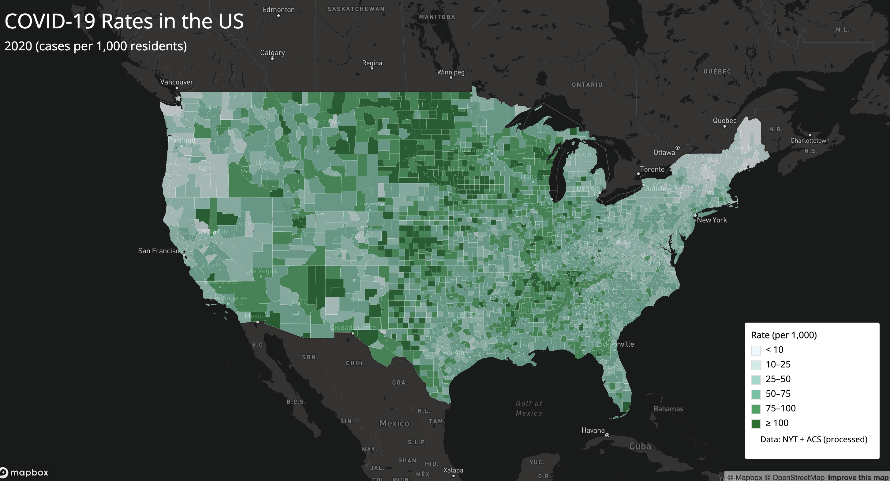
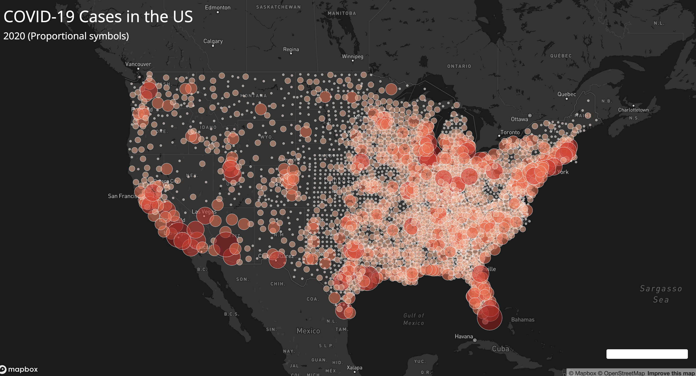

# COVID-19 in the United States (2020)

## Overview
This project presents two interactive web maps visualizing COVID-19 data
at the county level in the United States for the year 2020. The maps were
created as part of Lab 3 for GEOG 458 and are intended to demonstrate
thematic web mapping techniques using Mapbox GL JS.

## Maps
- **Choropleth Map – COVID-19 Rates**  
  Displays county-level COVID-19 case rates (cases per 1,000 residents).  
  Link:

- **Proportional Symbol Map – COVID-19 Cases**  
  Displays total COVID-19 case counts using proportional symbols.  
  Link:

## Methods
- COVID-19 case and death data were obtained from *The New York Times*.
- Population data were obtained from the 2018 ACS 5-year estimates.
- County boundary shapefiles were processed in QGIS.
- Unused attributes were removed and geometries were simplified using Mapshaper.
- Shapefiles were converted to GeoJSON format.
- Maps were built using Mapbox GL JS with an Albers equal-area projection.

## Libraries and Tools
- Mapbox GL JS
- Google Fonts (Open Sans)
- QGIS
- Mapshaper

## Data Sources
- The New York Times COVID-19 Dataset  
- U.S. Census Bureau County Boundaries  
- American Community Survey (2018, 5-year estimates)

## Screenshots
*(Images are stored in the img folder)*

  

## Credits
Author: Reed Bayless  
Course: GEOG 458 – Web GIS  
Instructor: Bo Zhao
